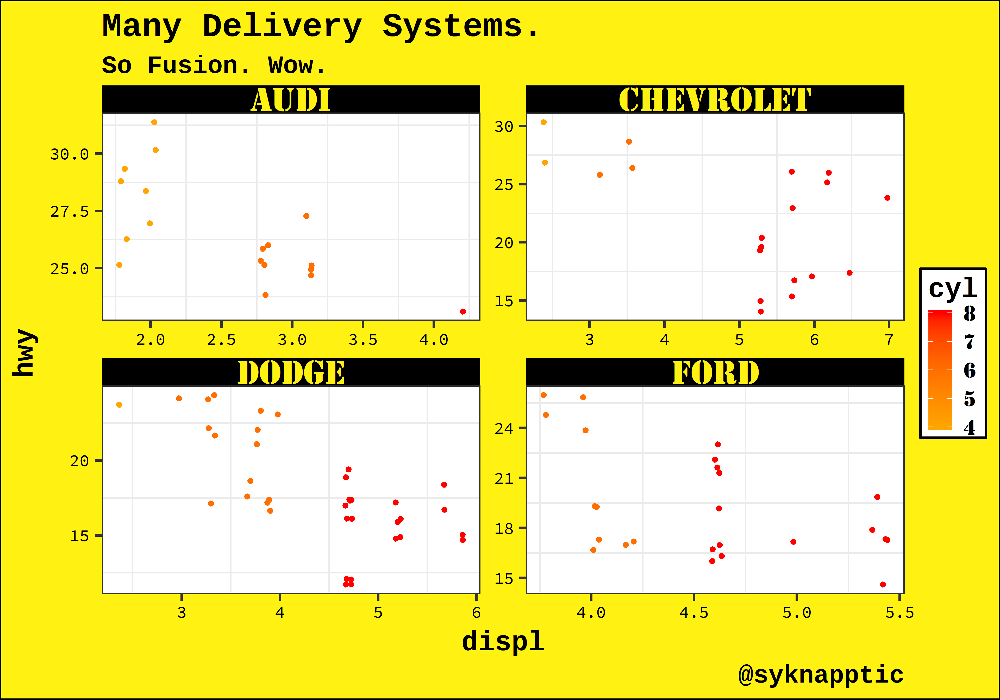

`syknappticThemes` : Custom themes for `ggplot2`
------------------------------------------------

This package is intended to allow for easy reuse of themes I've made for various projects.

### `theme_nuclear()`

``` r
ggplot(cars, aes(speed, dist, color = speed)) +
  geom_point() +
  scale_color_continuous(low = "orange", high = "red",
                         guide = guide_colorbar(barwidth = 20)) +
  theme_nuclear() +
  labs(title = "Much Deterrence.",
       subtitle = "Very Scary. Wow.",
       caption = "@syknapptic")
```


``` r
mpg %>%
  filter(manufacturer %in% c("audi", "chevrolet", "dodge", "ford")) %>%
  ggplot(aes(displ, hwy, color = cyl)) +
  # geom_point(show.legend = FALSE) +
  geom_jitter(show.legend = T) +
  scale_color_continuous(low = "orange", high = "red") +
  facet_wrap(~ manufacturer, scales = "free") +
  theme_nuclear() +
  theme(legend.position = "right") +
  labs(title = "Many Delivery Systems.",
       subtitle = "So Fusion. Wow.",
       caption = "@syknapptic")
```


